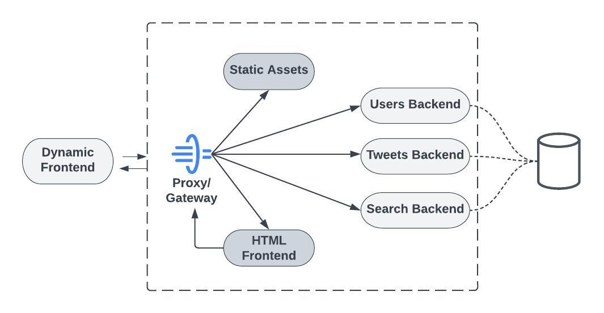
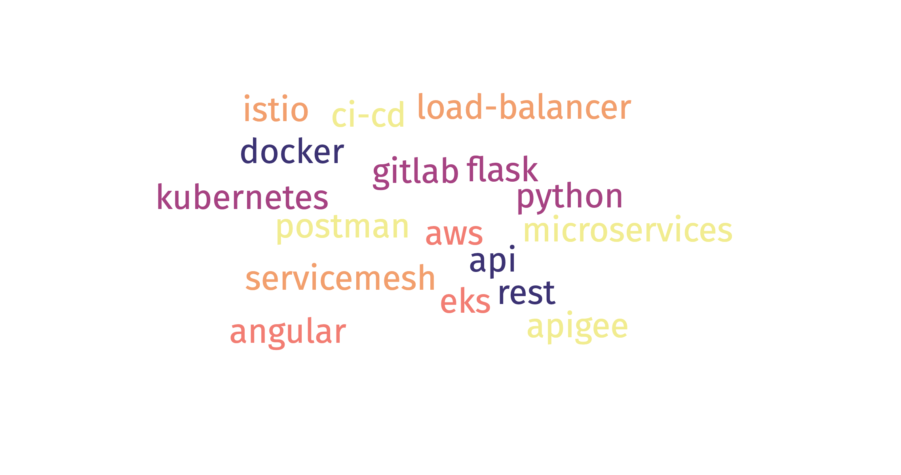
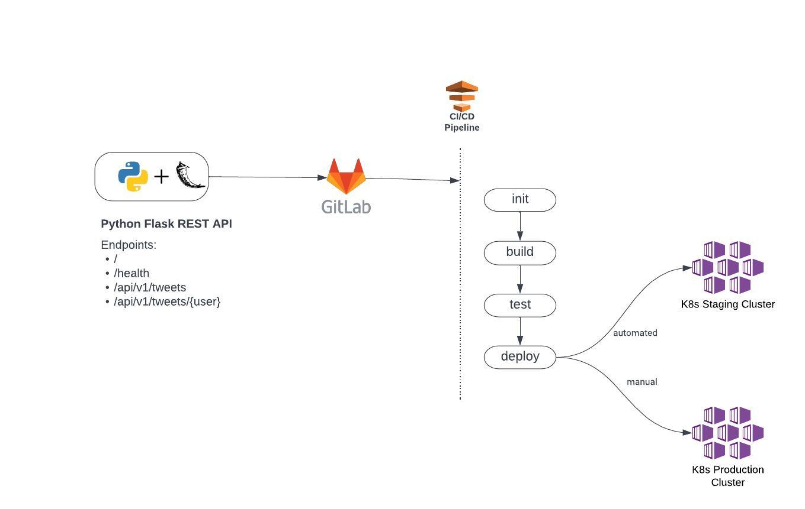

## Python Flask K8s
---

## How to run
* While at the directory level enter `docker-compose up` to run all micro services.
	* Tweets will be on `port 8000`
	* Users will be on `port 8001`
	* Search will be on `port 8002` 
    * Database will be on `port 8004`
* Run `docker-compose down` to terminate all of the services

Each service also contains a make file that can be run from the service level directory

Interactions with the database are done via SQLAlchemy. The same models are used accross the different microservices.
## Overview

System will be divided into following modules:
* **Users Backend**: 
 This will handle all authentication tasks and keep information about all users. It will store users data in database.
* **Tweets Backend**
  This will create and store tasks.
* **Search Backend**
  This will allow searching through tasks.
* **Proxy / API Gateway**
  This will route requests to proper backend. This needs to be externally accessible.
* **HTML Frontend**
  Single page application that calls backend APIs to render frontend in client. It will use the same APIs that are available externally. This will validate that the calls are useful, as we will use them first for our own client.
* **Dynamic Frontend**
 Allowing clients to access the backends will allow the creation of other clients than our HTML frontend such as mobile application.
* **Static Assets**
 A web server capable of handling static files. This will serve the styling for the HTML frontend and the index files and JavaScript files for the dynamic frontend.

 
 
### Tech Stack

- Each of the microservices will be deployed in its own Docker container (https://www.docker.com/). We will set up a Kubernetes cluster to orchestrate the different services.
- Backend services will be implemented in Flask (https://palletsprojects.com/p/flask/), using Flask-RESTPlus (https://flask-restplus.readthedocs.io/en/stable/) to generate a well-documented RESTful app

### POC Summary
A REST API written in Python hosted in Gitlab.
It utilizes automated Gitlab CI/CD pipeline to manage below stages of development:
- init
- build
- test
- deploy
    - staging (automated)
    - production (manual)

It contains Swagger integration and surfaces dedicated page for trying out various endpoints.

Deployment is automated to Staging environment. Once successfully deployed to staging, we can initiate manual deployemnt to Production environment.

### API Endpoints:
- /
- /health
- /api/v1/tweets
- /api/v1/tweets/{username}
## Tech Stack
* Gitlab
* Python, FLASK, Flask-RESTX
* AWS ECR
* AWS ECS

### Pipeline Architecture
 

## Next Steps
- Automate multi region Staging and Production cluster creation in EKS using Terraform via Gitlab pipeline
- Implement backend microservices using Python Flask.
- Deploy backend and frontend sevices to Kubernetes cluster
- Implement APIGEE gateway
- Implement service mesh using ISTIO to monitor traffic within microservices
- Create dashboard using Grafana for monitoring overall cluster and service health

## Useful Links

### Required Installations

- [Git](https://git-scm.com/book/en/v2/Getting-Started-Installing-Git)
- [Setup VS Code](https://code.visualstudio.com/docs/setup/setup-overview)
- [Docker Desktop](https://www.docker.com/products/docker-desktop/)
- [Python](https://www.python.org/downloads/)